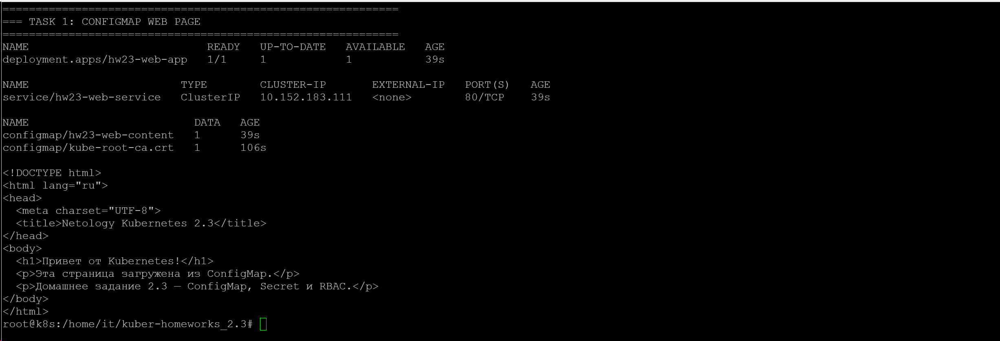
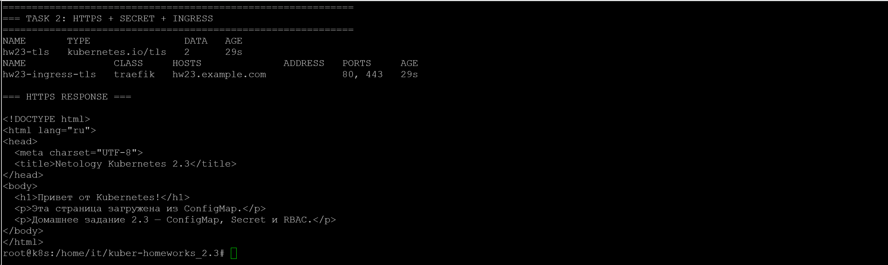
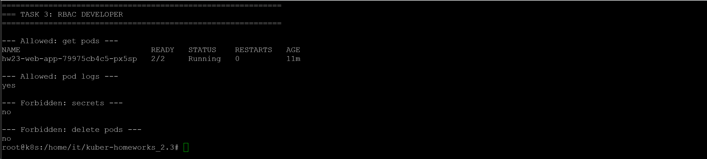
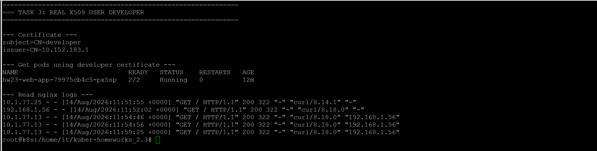

# Домашнее задание к занятию «Настройка приложений и управление доступом в Kubernetes»

Домашняя работа выполнена в одновузловом кластере MicroK8s.

## Параметры стенда

```text
Kubernetes:  v1.35.6
Node:        k8s
Node IP:     192.168.1.56
OS:          Ubuntu 26.04 LTS
Namespace:   hw23
Ingress:     Traefik
RBAC:        enabled
```

Все namespace-scoped ресурсы этого задания размещены в отдельном namespace `hw23`.

---

# Задание 1. ConfigMap

Создано приложение из двух контейнеров:

- `nginx` на порту `80`;
- `wbitt/network-multitool` на порту `8080`.

Манифесты:

- [`deployment.yaml`](deployment.yaml)
- [`configmap-web.yaml`](configmap-web.yaml)

ConfigMap `hw23-web-content` содержит `index.html` и монтируется в nginx в `/usr/share/nginx/html`.

```yaml
volumes:
  - name: web-content
    configMap:
      name: hw23-web-content
```

Для `multitool` задан отдельный HTTP-порт:

```yaml
env:
  - name: HTTP_PORT
    value: "8080"
```

После запуска Deployment имеет состояние `1/1`, а Pod — `2/2 Running`.

Создан Service `hw23-web-service`, направляющий TCP/80 на nginx.

Проверка страницы через Service возвращает содержимое ConfigMap:

```text
Привет от Kubernetes!
Эта страница загружена из ConfigMap.
Домашнее задание 2.3 — ConfigMap, Secret и RBAC.
```



---

# Задание 2. HTTPS с Secret

Манифесты:

- [`secret-tls.yaml`](secret-tls.yaml)
- [`ingress-tls.yaml`](ingress-tls.yaml)

Для учебного имени `hw23.example.com` создан самоподписанный сертификат:

```bash
openssl req \
  -x509 \
  -nodes \
  -days 365 \
  -newkey rsa:2048 \
  -keyout tls.key \
  -out tls.crt \
  -subj "/CN=hw23.example.com" \
  -addext "subjectAltName=DNS:hw23.example.com"
```

Сертификат содержит:

```text
CN=hw23.example.com
SAN=DNS:hw23.example.com
```

Создан TLS Secret:

```text
Name: hw23-tls
Type: kubernetes.io/tls
Keys: tls.crt, tls.key
```

Ingress `hw23-ingress-tls` использует Traefik и Secret `hw23-tls`:

```yaml
spec:
  ingressClassName: traefik
  tls:
    - hosts:
        - hw23.example.com
      secretName: hw23-tls
```

Проверка HTTPS выполнена без настройки публичного DNS:

```bash
curl -k \
  --resolve hw23.example.com:443:192.168.1.56 \
  -i \
  https://hw23.example.com/
```

Результат:

```text
HTTP/2 200
server: nginx/1.31.3
```

Traefik реально отдаёт сертификат `CN/SAN=hw23.example.com`, а приложение возвращает страницу из ConfigMap.



> В учебном задании TLS Secret хранится в YAML по требованию работы. В реальной инфраструктуре приватные ключи не следует хранить в Git в открытом виде.

---

# Задание 3. RBAC

RBAC включён командой:

```bash
microk8s enable rbac
```

До включения API Server использовал:

```text
--authorization-mode=AlwaysAllow
```

После включения:

```text
--authorization-mode=RBAC,Node
```

## Пользователь developer

Для пользователя создан отдельный X.509-сертификат.

```bash
openssl genrsa -out developer.key 2048
openssl req -new -key developer.key -out developer.csr -subj "/CN=developer"
```

CSR подписан CA MicroK8s. Сертификат проверен:

```text
subject=CN=developer
TLS Web Client Authentication
developer.crt: OK
```

## Role

Манифест: [`role-pod-reader.yaml`](role-pod-reader.yaml)

Role `hw23-pod-reader` разрешает:

```text
pods:      get, list, watch
pods/log:  get
```

Отдельного RBAC verb `describe` в Kubernetes нет: `kubectl describe pod` использует операции чтения API.

## RoleBinding

Манифест: [`rolebinding-developer.yaml`](rolebinding-developer.yaml)

RoleBinding `hw23-developer-pod-reader` связывает пользователя `developer` с Role `hw23-pod-reader` в namespace `hw23`.

## Проверка прав

Разрешено:

```text
list pods:      yes
get pod:        yes
get pod logs:   yes
```

Запрещено:

```text
create pod:       no
delete pod:       no
get secrets:      no
list deployments: no
```

Команда из задания работает:

```bash
microk8s kubectl get pods -n hw23 --as=developer
```



## Проверка реальным X.509-пользователем

Для `developer` создан отдельный kubeconfig с клиентским сертификатом.

С его использованием успешно выполняются:

```text
get pods
kubectl describe pod
kubectl logs
```

Попытка получить TLS Secret возвращает `Forbidden`, и попытка удалить Pod также возвращает `Forbidden`.

Это подтверждает, что пользователь действительно аутентифицируется клиентским сертификатом и получает только права, заданные Role.



---

# Итог

| Задание | Механизм | Результат |
|---|---|---|
| 1 | ConfigMap | HTML-страница подключена в nginx как файл |
| 2 | Secret + TLS + Ingress | HTTPS работает через Traefik с самоподписанным сертификатом |
| 3 | RBAC + X.509 | `developer` имеет только read-only доступ к Pod и логам |

Ключевые результаты:

- ConfigMap успешно используется nginx;
- HTTPS отвечает `HTTP/2 200`;
- TLS Secret имеет тип `kubernetes.io/tls`;
- RBAC включён в MicroK8s;
- `developer` аутентифицируется X.509-сертификатом;
- пользователь может читать Pod, выполнять `describe` и читать логи;
- пользователь не может читать Secrets или удалять Pod.

---

# Структура репозитория

```text
.
├── README.md
├── deployment.yaml
├── configmap-web.yaml
├── secret-tls.yaml
├── ingress-tls.yaml
├── role-pod-reader.yaml
├── rolebinding-developer.yaml
└── images
    ├── task1-configmap-curl.png
    ├── task2-https-curl.png
    ├── task3-rbac-developer.png
    └── task3-x509-developer.png
```
---

## Итог

Все задания выполнены и подтверждены скриншотами.
